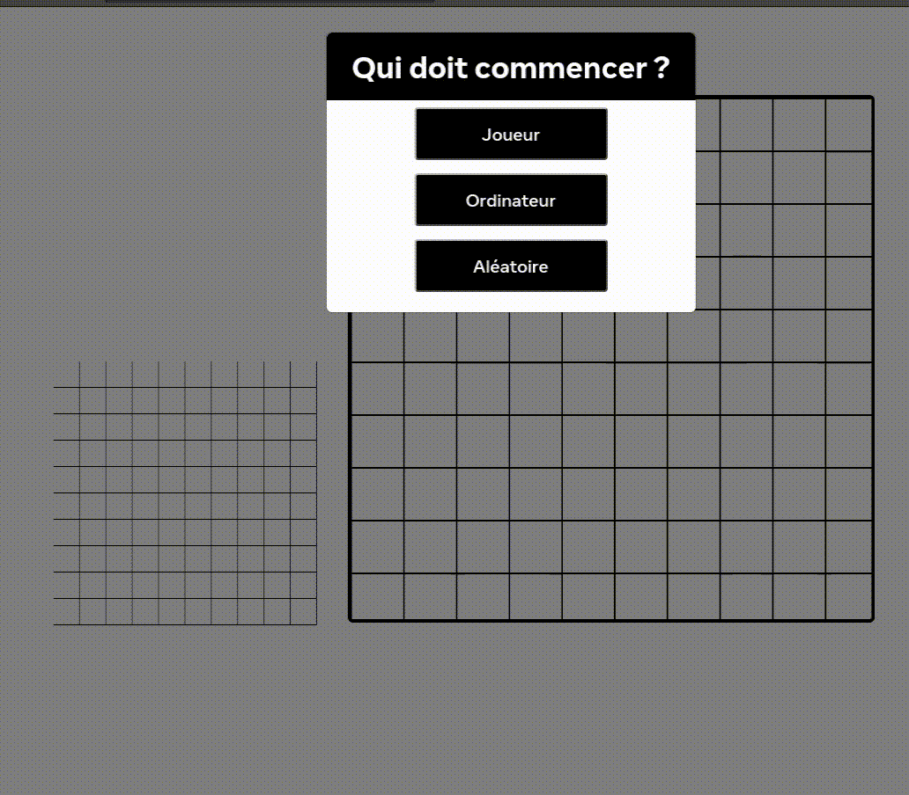

# W1 - JavaScript - W-SPE-502

## My_Battleship - Coulez votre adversaire !

### INTRODUCTION

Reprise d'un projet inachevé que nous devions rendre fonctionnel et adapter à notre envie.

### RESTRICTIONS

Nous n'avions pas le droit d'utiliser des librairies autres que celles déjà incluses dans le projet !

### DÉMO

<a href="https://gildasld.github.io/MyBattleShip/">

<a/>
